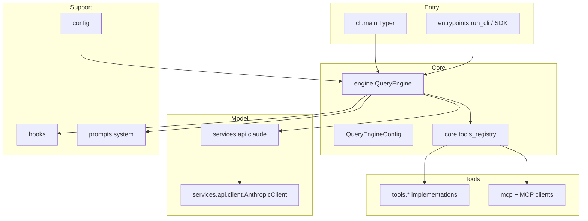
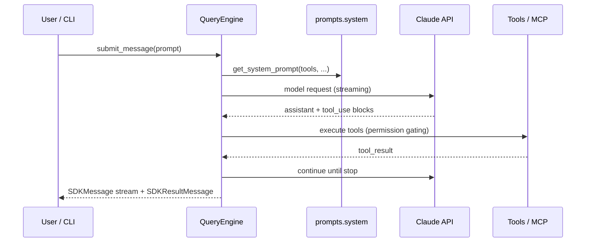

# System architecture

This document describes how **claude-code-python** (`claude-code` on PyPI) is structured: entry points, conversation engine, tools, services, and external integrations.

## Goals

- **Agentic coding loop**: user input → prompt assembly → Claude API → tool calls → results → next turn.
- **Pluggable tools**: built-in filesystem/shell/search tools plus MCP-provided tools.
- **Session state**: messages, file-read cache, permissions, cost tracking across turns.

## High-level diagram

## Layered view

| Layer | Python packages / modules | Responsibility |
|-------|---------------------------|----------------|
| **CLI / entry** | `claude_code.cli`, `claude_code.entrypoints` | Argument parsing, interactive loop, bootstrap (`initialize` / `shutdown`). |
| **Engine** | `claude_code.engine` | `QueryEngine`, `QueryEngineConfig`, `ask()` — conversation lifecycle, yields `SDKMessage` / `SDKResultMessage`. |
| **Core (shared types)** | `claude_code.core` | Alternate `QueryEngine` wiring (`core.query_engine`), Anthropic helpers (`query_engine_anthropic`), **tool registry** (`tools_registry`), **tool ABC** (`tool.py`) used by registry paths. |
| **Tools** | `claude_code.tools` | Concrete tools (`bash`, `file_read`, …) built on `tools.base.Tool`; names/schemas for the model. |
| **Services** | `claude_code.services` | HTTP client, retries, OAuth, compaction, LSP, MCP orchestration, limits, notifications, etc. |
| **MCP** | `claude_code.mcp` | Config types for MCP servers (stdio, SSE, HTTP). |
| **Config & state** | `claude_code.config`, `claude_code.bootstrap`, `claude_code.state`, `claude_code.session` | Global/project config, session id, persistence hooks. |
| **Server / bridge** | `claude_code.server`, `claude_code.bridge` | Direct-connect / WebSocket-oriented session management (stubs or partial parity with TS). |

## Dual engine and tool stacks

The codebase reflects a **TypeScript migration**. Two related stacks exist:

1. **`claude_code.engine`** — primary exports: `QueryEngine`, `QueryEngineConfig`, `ask`. Used by the CLI wiring in `cli/main.py` and re-exported from `claude_code.__init__`.
2. **`claude_code.core.query_engine`** — lower-level engine tied to `claude_code.core.tool` types for Anthropic message/tool execution.

Similarly, **`claude_code.core.tool.Tool`** (dataclass-oriented, `call` async) and **`claude_code.tools.base.Tool`** (generic ABC with `validate_input`, Pydantic schemas) are **not identical**. New tool implementations live under `claude_code.tools`; `core.tools_registry` lazy-imports specific tool classes for assembly. Integrators should follow existing tools as examples and check which base class a given tool uses.

## Conversation lifecycle (QueryEngine)

## Tool pool assembly

`core.tools_registry.assemble_tool_pool(permission_context, mcp_tools)`:

1. Loads built-in tools via `get_tools()` (mode flags, deny rules, `is_enabled()`).
2. Filters MCP tools with the same deny rules.
3. Sorts by name for stable ordering (prompt cache).
4. Dedupes by name; **built-ins win** over MCP.

Feature flags (environment) affect which built-ins load — see [Configuration](#configuration) below.

## Hooks

`claude_code.hooks` provides registration and execution of hooks (e.g. permission logging, lifecycle). Hook types and executor live under `hooks/` and `utils/hooks/`.

## Upstream proxy

`claude_code.upstreamproxy` contains relay/proxy helpers for routing API traffic (parity with upstream TS patterns).

## Configuration

### Global config file

- Path from `config.get_config_path()` → `config.json` under the Claude config home (see `utils/env.get_claude_config_home_dir`, overridable via `CLAUDE_CONFIG_DIR`).

### Environment variables (selected)

| Variable | Effect |
|----------|--------|
| `ANTHROPIC_API_KEY` | API authentication (see `services.api.types`). |
| `ANTHROPIC_BASE_URL` | API base URL. |
| `ANTHROPIC_MODEL` | Default model name for API types layer. |
| `CLAUDE_CODE_MODEL` | Default model for main loop (`engine.query_engine`). |
| `CLAUDE_CODE_THINKING` | Enables adaptive thinking when `true`/`1`/`adaptive`. |
| `CLAUDE_CODE_SIMPLE` | Restricts tool set to shell + read + edit (+ coordinator extras). |
| `CLAUDE_CODE_REPL_MODE` | REPL wraps shell/read/edit; hides duplicate standalone tools. |
| `CLAUDE_CODE_TODO_V2` | Enables task tools (`TaskCreate`, …). |
| `CLAUDE_CODE_TOOL_SEARCH` | Adds `ToolSearch` tool. |
| `CLAUDE_CODE_EMBEDDED_SEARCH` | Suppresses standalone Glob/Grep when embedded search is used. |
| `CLAUDE_CODE_COORDINATOR_MODE` | Coordinator/simple-mode tool additions. |
| `CLAUDE_CODE_SESSION_ID` | Set at init if missing (`entrypoints.init`). |
| `CLAUDE_CONFIG_DIR` | Config directory override. |

Fuller lists appear in `docs/TOOLS.md` and `docs/API.md`.

## Dependencies (runtime)

Declared in `pyproject.toml`: `anthropic`, `mcp`, `pydantic`, `httpx`, `aiofiles`, `anyio`, `typer`, `rich`, `tiktoken`, `python-dotenv`, `structlog`, `pyyaml`, `websockets`, `json5`, `Pillow`, `packaging`, `pyautogui`. Optional: OpenTelemetry (`telemetry` extra), dev tools (`dev` extra).

## Related documents

- [PACKAGES.md](./PACKAGES.md) — package map
- [DATA_FLOW.md](./DATA_FLOW.md) — data paths
- [TOOLS.md](./TOOLS.md) — tools
- [SERVICES.md](./SERVICES.md) — services
- [API.md](./API.md) — public Python API
