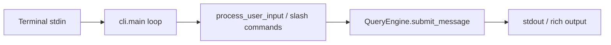
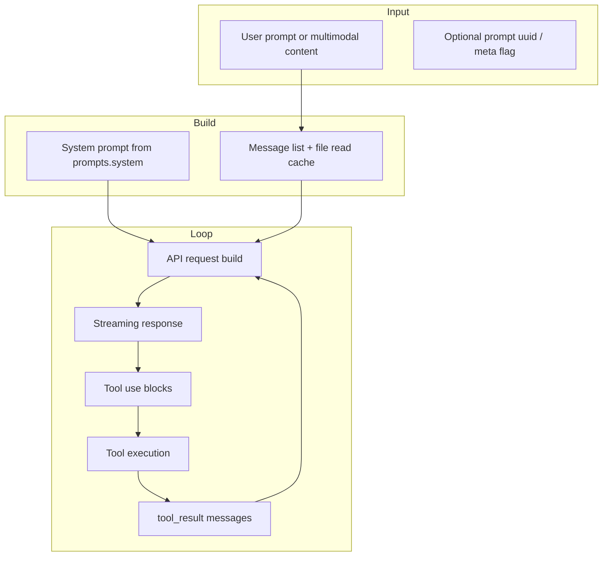
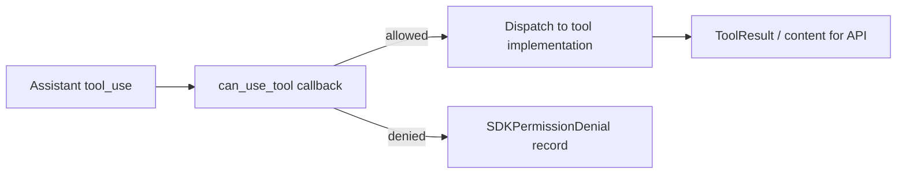
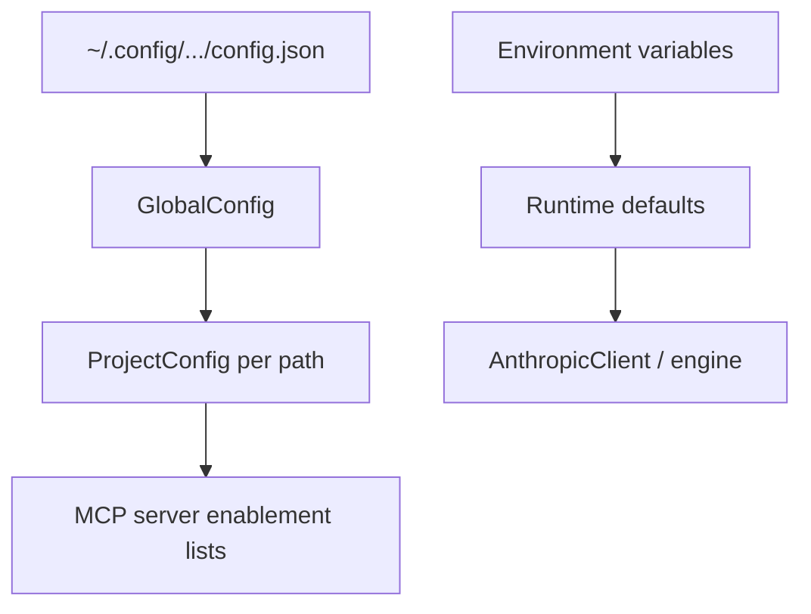

# Data flow

How requests, messages, tool I/O, and configuration move through **claude-code-python**.

## 1. CLI interactive path

1. User types a line in the Typer-driven CLI (or `entrypoints.run_interactive`).
2. Input is normalized; slash commands may short-circuit without calling the API (`local_command` messages).
3. `QueryEngine` appends user messages to `_mutable_messages`.
4. Streaming / final `SDKResultMessage` is rendered to the user.

## 2. QueryEngine turn

**Steps:**

1. **CWD** — `set_cwd(config.cwd)` for consistent relative paths.
2. **Model** — `user_specified_model` or `CLAUDE_CODE_MODEL` or default Sonnet id.
3. **Thinking** — `ThinkingConfig` from config or `CLAUDE_CODE_THINKING`.
4. **System prompt** — `get_system_prompt(tools=..., custom_prompt=..., ...)`.
5. **User input processing** — `_process_user_input` produces `Message` objects.
6. **Query loop** — `_run_query_loop` drives Anthropic calls and tool execution until stop.
7. **Result** — `_extract_result_text()` plus usage/cost from `core.cost_tracker`.

## 3. Tool execution path

- **Permission context** lives in `AppState.tool_permission_context` (`engine` types) or `core.tool.ToolPermissionContext` depending on stack.
- **Registry** tools are selected with `assemble_tool_pool`; MCP tools are merged in after built-ins.
- Tool implementations may update **file read cache** (`FileStateCache`) to avoid redundant reads.

## 4. Configuration data flow

- `get_global_config()` reads JSON into `GlobalConfig` (`config.types`).
- `get_project_config(cwd)` returns `ProjectConfig` for the normalized absolute project path.
- MCP server lists on `ProjectConfig` (`enabled_mcp_servers`, `disabled_mcp_servers`, …) inform which servers connect for a workspace.

## 5. MCP tool flow

1. MCP servers are described by `mcp.types` configs (stdio command, SSE/HTTP URLs, env, headers).
2. Clients (under `services.mcp`) discover tools and resources.
3. Serialized tools are wrapped as `Tool` instances compatible with the pool.
4. `ListMcpResources` / `ReadMcpResource` built-ins expose MCP resources to the model when registered.

## 6. Session and identity

- `entrypoints.init` ensures `CLAUDE_CODE_SESSION_ID` exists.
- `bootstrap.get_session_id` is used when emitting `SDKResultMessage.session_id`.
- Session persistence can be disabled via bootstrap flags (see `is_session_persistence_disabled` in engine).

## 7. Cost and usage accounting

- `core.cost_tracker` aggregates API duration, USD estimates, per-model usage.
- `SDKResultMessage` carries `usage`, `total_cost_usd`, `model_usage`, `permission_denials`.

## 8. Hooks and side effects

- Hooks may run around compaction, permissions, or lifecycle events (`hooks.executor`, `utils/hooks`).
- Hook progress is modeled separately from tool progress in `core.tool` (`HookProgress`).

## 9. Direct connect / server path (partial)

`server.DirectConnectSessionManager` is the placeholder for WebSocket-oriented sessions: config carries `server_url`, `ws_url`, `session_id`, optional `auth_token`; callbacks receive messages and permission requests. Full wire protocol parity may still evolve.

## Related documents

- [ARCHITECTURE.md](./ARCHITECTURE.md)
- [TOOLS.md](./TOOLS.md)
- [API.md](./API.md)
